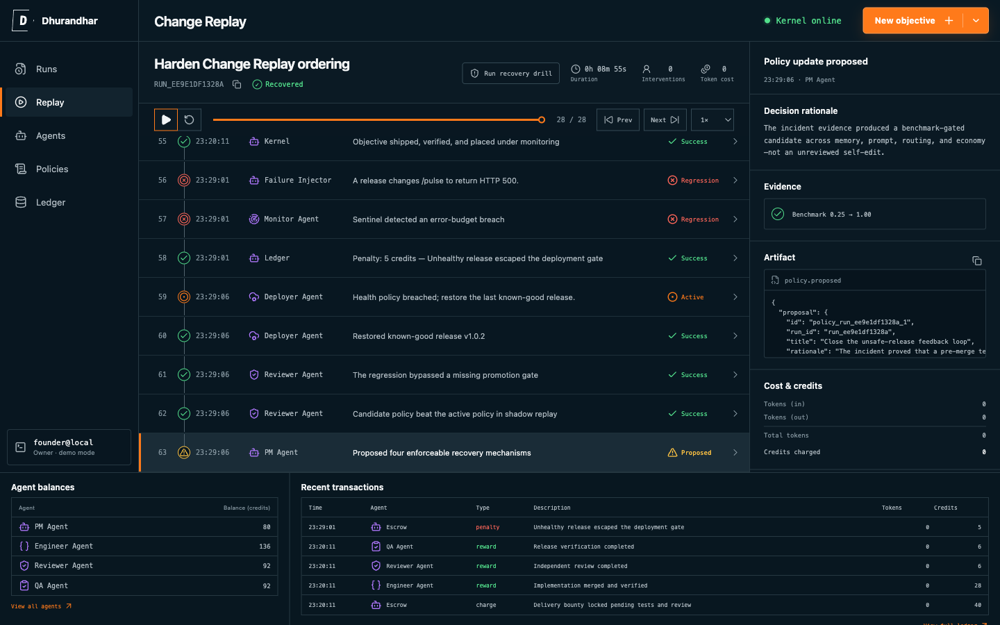
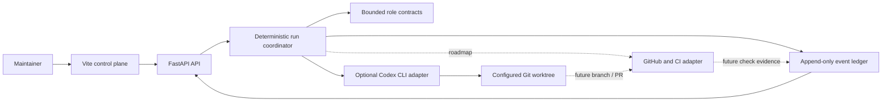

# Dhurandhar

**An objective goes in. An auditable delivery-and-recovery run comes out — with receipts.**

Dhurandhar is an experimental developer control plane for coordinating a small, persistent software team. A maintainer supplies an objective; the kernel moves it through product, engineering, review, QA, release, monitoring, and recovery roles while recording every material transition in a hash-chained replay journal. The default runtime is a zero-secret deterministic fixture; an explicitly enabled Codex CLI adapter can inspect or edit one configured Git worktree.

The product is the engineering control plane. Its central proof artifact is **Change Replay**, the interface used to inspect a self-hosted pulse change, inject a controlled production fault, verify rollback, benchmark four policy improvements, and watch a later run inherit the approved policy.

> [!IMPORTANT]
> Dhurandhar is a hackathon prototype, not an unattended production deployment system. Write access, self-improvement, and automatic merge are off by default.



The generated [design concept](docs/design-concept.png) and the inspected [visual fidelity ledger](docs/FIDELITY_LEDGER.md) are included separately; the image above is the running implementation backed by the FastAPI event journal.

## What it demonstrates

- **Long-horizon coordination:** one objective moves through scope, implementation, review, verification, release, monitoring, and recovery.
- **Evidence over role-play:** material events carry typed payloads, test names, health samples, version IDs, policy scores, and a verifiable previous-event hash.
- **Recovery as a product primitive:** a controlled HTTP 500 causes an error-budget alert, credit penalty, rollback to the known-good version, root-cause event, and policy benchmark.
- **Bounded self-improvement:** every incident proposal contains one memory, prompt, routing, and economy mechanism; promotion requires a higher benchmark score, zero critical regressions, and human approval.
- **A testable no-secret path:** sample mode generates and replays the same deterministic run without an OpenAI key or GitHub token.

## Honest bootstrap boundary

Dhurandhar did **not** create itself from an empty directory.

The human builder authored the seed: the API, orchestration loop, Codex adapter, event schema, frontend, tests, safety defaults, deployment scaffold, and first product brief. The deterministic sample is generated by that code; it is not represented as model-authored work.

Implemented self-improvement begins after a monitored incident: Dhurandhar restores the stable release, evaluates a candidate policy in shadow replay, requires a human decision, and applies approved mechanisms to future runs. The optional Codex adapter can make bounded changes inside a configured Git worktree, but this MVP does not create branches, commits, pull requests, merges, or real infrastructure deployments. Human interventions remain visible rather than being relabeled as agent work.

The boundary is intentional:

| Human-reserved | Agent workflow may change |
| --- | --- |
| Secrets, spending ceilings, repository allowlist, branch protection, production credentials, and final release authority | Product UI, replay views, tests, documentation, non-critical policies, and other explicitly scoped repository files |

“Self-improving” therefore means **measured incidents can change future orchestration policy, and a triple-opt-in Codex runtime can edit a disposable worktree**. It does not mean recursive execution, silent mutation of the running process, autonomous merge, or unrestricted host access.

## Architecture at a glance



FastAPI owns run state, policies, adapters, and the ordered JSONL event ledger. The Vite frontend renders objectives, runs, agents, policies, usage, and Change Replay. In the experimental write mode, implementation is restricted to the configured Git worktree. Commit, push, pull request, merge, and infrastructure deployment adapters are not part of this MVP.

See [Architecture](docs/ARCHITECTURE.md) for the state machine, event contract, trust boundaries, and self-improvement path. See [Visual specification](docs/VISUAL_SPEC.md) for the product UI contract and [Submission draft](docs/SUBMISSION.md) for judge-ready copy and the last-mile checklist.

## Quickstart

### Docker — recommended

Prerequisites: Docker with Compose v2.

```bash
cp .env.example .env
docker compose up --build
```

Open [http://localhost:8000](http://localhost:8000). The checked-in defaults use sample mode, disable repository writes, and require no secrets. The health check is available at [http://localhost:8000/api/health](http://localhost:8000/api/health).

Equivalent shortcuts:

```bash
make setup
make up
```

### Local development

Prerequisites: Python 3.12+, Node.js 22+, npm, and Git.

```bash
python -m venv .venv
source .venv/bin/activate
python -m pip install -r backend/requirements.txt

cd frontend
npm ci
cd ..
```

Run the two development servers in separate terminals:

```bash
make dev-backend
make dev-frontend
```

The frontend runs at [http://localhost:5173](http://localhost:5173) and talks to the FastAPI service at [http://localhost:8000](http://localhost:8000).

## Three-minute demo path

The demo tells one product story; it does not switch to a second generated application.

1. Open **Replay** on **Ship Dhurandhar's own monitored pulse endpoint** and show its plan, implementation-runtime, review, QA, release, and healthy-monitor events.
2. Click **Run recovery drill**. The UI calls the real fault-injection and rollback endpoints; select the HTTP 500 alert, restored v1.0.1 event, and shadow benchmark evidence.
3. Open **Policies**. Show memory, prompt, routing, and economy changes sharing one `0.25 → 1.00` benchmark decision, then click **Promote**.
4. Create the prefilled **Harden Change Replay ordering** objective and return to **Replay**.
5. Select **This run inherited mechanisms learned from a prior incident**, then inspect the deployment artifact showing `"strategy": "canary-10-percent"`.
6. End on the ledger. Measured model tokens and internal credits are deliberately separate; deterministic mode truthfully reports zero model tokens.

The memorable proof is causal and bounded: an observed failure produces a benchmark-cleared operating change, and the next run visibly behaves differently.

## Judge testing path

### Path A: zero-secret replay (under five minutes)

1. Follow the Docker quickstart.
2. Confirm `GET /api/health` returns a healthy response.
3. Open **Replay**, click **Run recovery drill**, and inspect fault, monitor, rollback, analysis, benchmark, and proposal events.
4. Promote the proposal in **Policies**, create another objective, and confirm the next run inherits four mechanisms and uses the canary strategy.
5. Confirm event sequence numbers remain stable while seeking backward and forward, then run the local verification suite if desired:

   ```bash
   make test
   ```

This path is deterministic and does not grant GitHub or model access.

### Path B: opt-in local Codex inspection

The seed Codex adapter is deliberately read-only: it can inspect the repository and return an implementation proposal, but it cannot apply a patch, create a branch, or merge. Run this path locally because the production image does not bundle the Codex CLI.

1. Install and authenticate Codex on the host.
2. Set `DHURANDHAR_RUNTIME=codex`, `DHURANDHAR_ENABLE_CODEX_RUNTIME=true`, and `DHURANDHAR_CODEX_WORKDIR` to the repository root.
3. Start the backend with `make dev-backend`, then submit a small objective with explicit acceptance criteria.
4. Inspect the captured session summary and verify that the repository remains unchanged.

The GitHub and write-policy variables in `.env.example` reserve the contract for a future guarded branch/PR adapter. They do not enable branch, pull-request, or merge writes in the seed adapter. Test the experimental local write path only against a disposable worktree, with automatic merge still disabled.

### Path C: experimental Codex worktree implementation

The local adapter also has a narrowly scoped workspace-write mode. It requires all three Codex settings: `DHURANDHAR_RUNTIME=codex`, `DHURANDHAR_ENABLE_CODEX_RUNTIME=true`, and `DHURANDHAR_CODEX_APPLY_CHANGES=true`. Point `DHURANDHAR_CODEX_WORKDIR` at a disposable Git worktree, submit a bounded objective, then inspect `git diff` and the captured run evidence.

This mode lets Codex edit only the configured worktree under its workspace-write sandbox. The adapter does not commit, push, merge, or deploy, and repository commands retain the sandbox's network restriction. (The Codex model call itself still requires Codex authentication and network connectivity.) Those delivery operations remain separate policy-controlled steps.

## How GPT-5.6 and Codex are used

Sample mode makes no model or network calls. In the seed implementation, the optional OpenAI Codex CLI adapter performs a read-only repository inspection or, behind a third flag, edits one configured Git worktree. Role decisions shown in deterministic mode are fixtures, not GPT-5.6 output. Any demo claim that a model edited a particular change must be backed by a live run and repository diff; configuration alone is not proof of model use.

The role contract is designed so a future GPT-5.6 adapter can supply bounded decisions:

- the product role converts an objective into acceptance criteria and bounded work;
- the reviewer searches for correctness, safety, and regression risks;
- QA turns those risks into executable checks;
- the policy role may propose a policy change but cannot apply protected policy itself;
- summaries preserve decision context for later cycles.

Codex is the optional implementation runtime. It receives a scoped objective and either inspects the repository read-only or edits the configured worktree in `workspace-write` mode. This seed records runtime mode, change identifier, and the bounded result summary. Full patch, command-trace, token-usage, commit, and PR evidence are roadmap work and are not claimed here.

The Codex subprocess receives a deliberately reduced environment and a prompt that forbids secret disclosure. The current coordinator enforces state transitions, journal integrity, the policy benchmark, and approval requirements. Repository allowlists, spend budgets, and merge permissions remain contracts for future adapters rather than current enforcement claims.

The primary Codex `/feedback` session ID used for the core build must be added to the final hackathon submission and release notes; it is intentionally not fabricated here.

## Safety and self-improvement model

Safe defaults enforced by the current code are part of the product contract:

- sample/read-only mode by default;
- independent runtime-enable and apply-changes flags before workspace writes;
- workspace-write mode requires the configured directory to be a Git worktree;
- Codex runs without shell interpolation and with a bounded prompt and timeout;
- no direct edits to the running deployment;
- the adapter does not commit, push, merge, deploy, or receive general environment variables;
- policy changes require an improving benchmark, zero critical regressions, and human approval;
- append-only, ordered audit events;
- SHA-256 previous-hash verification on every journal read;
- rollback is a first-class state, not a hidden cleanup action.

The repository allowlist, protected-path, budget, GitHub, and automatic-merge variables in `.env.example` document the next adapter contract; they are not yet enforcement claims.

Each incident policy proposal contains exactly one change in each bounded self-improvement class: **memory**, **prompt**, **routing**, and **economy**. It records an immutable benchmark ID, metric, case count, baseline score, candidate score, and critical-regression count. Approval is rejected unless the candidate strictly beats the baseline and has zero critical regressions; human approval is still required after that automated gate passes.

These controls reduce risk; they do not make generated code intrinsically safe. Treat every output as an untrusted change until reviewed and verified.

## Repository layout

```text
.
├── backend/                 FastAPI control plane, adapters, and tests
├── frontend/                Vite control room and replay UI
├── docs/
│   ├── ARCHITECTURE.md      Components, state machine, and trust model
│   ├── VISUAL_SPEC.md       UI behavior and visual contract
│   ├── FIDELITY_LEDGER.md    Concept-to-implementation comparison
│   └── design-concept.png   Design north star
├── .github/workflows/ci.yml
├── Dockerfile
├── docker-compose.yml
└── render.yaml
```

## Verification

```bash
make test       # backend and frontend tests
make lint       # available static checks
make build      # production frontend build
make docker     # production container build
```

CI runs backend compilation/tests, frontend lint/tests/build, and a container build without application secrets.

## Project status

Dhurandhar is an OpenAI Build Week prototype. Interfaces, event schemas, and safety policies may change while the experiment is active. Claims in the demo should be backed by the public repository history and captured run evidence.

## License

[MIT](LICENSE) © 2026 Himanshu Jha.
