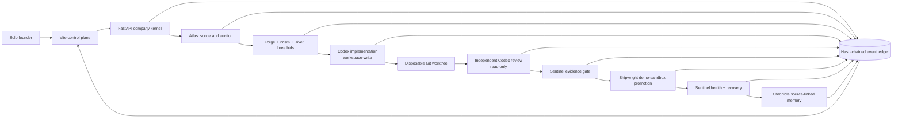

# Dhurandhar

**Give it one software objective. Eight persistent agents auction the work, build it with Codex, review it independently, verify it, promote it inside a recoverable sandbox, monitor it, and learn from failure - with receipts.**

Dhurandhar is an experimental software-company control plane for a solo founder. It turns an objective into an auditable SDLC run instead of stopping at a code patch. Its proof surface, **Change Replay**, links every consequential decision to source evidence in an append-only, SHA-256-chained event journal.

The submission story is a **live Codex workspace-write run** against a disposable Git worktree. The captured target objective adds a privacy-safe session evidence export to **Misconception Debugger**, a separate Education project. Dhurandhar is the Developer Tools entry and the control plane around that work; it does not claim Misconception Debugger as an internal Dhurandhar feature.

[Public demo](https://dhurandhar-asc.onrender.com) · [Source repository](https://github.com/himanshu748/dhurandhar) · [Live Codex evidence](docs/LIVE_EVIDENCE.md) · [Video shot list](docs/VIDEO_SHOT_LIST.md)

> [!IMPORTANT]
> Dhurandhar is a hackathon prototype, not an unattended production deployment system. A successful "promotion" is an internal, reversible `demo-sandbox` lifecycle transition. The current adapter does not commit, push, merge, or deploy to external infrastructure.


The image above is an implementation capture, not proof of a model call. The generated [design concept](docs/design-concept.png) and [visual fidelity ledger](docs/FIDELITY_LEDGER.md) are kept separately.

## The persistent company

Dhurandhar always starts with the same eight agents. Their identities, capabilities, balances, memory seeds, and status persist in the event-sourced company state.

| Agent | Contract | Consequential responsibility |
| --- | --- | --- |
| [Atlas](agents/roles/atlas.md) | Product manager | Scope the objective, name acceptance evidence, and run the auction |
| [Forge](agents/roles/forge.md) | Backend engineer | Bid on and implement backend-heavy objectives |
| [Prism](agents/roles/prism.md) | Frontend engineer | Bid on and implement interface-heavy objectives |
| [Rivet](agents/roles/rivet.md) | Platform engineer | Bid on and implement delivery or infrastructure-heavy objectives |
| [Aegis](agents/roles/aegis.md) | Adversarial reviewer | Run an independent, read-only review and issue a structured verdict |
| [Sentinel](agents/roles/sentinel.md) | QA and saboteur | Falsify claims, verify executable checks, and monitor sandbox health |
| [Shipwright](agents/roles/shipwright.md) | Release and recovery engineer | Gate reversible sandbox promotion and restore known-good state |
| [Chronicle](agents/roles/chronicle.md) | Historian | Preserve source-linked changelogs and durable operating memories |

The immutable operating boundary is in the [company constitution](agents/constitution.md).

## What makes the run more than agent role-play

### All three engineers bid

Every implementation auction requires exactly one bid from Forge, Prism, and Rivet. A bid is eligible only when the agent is available and funded, has the required capability, stays within budget, clears the credibility threshold, and cites evidence belonging to that engineer. Atlas selects the **lowest-cost eligible bid**; credibility, evidence score, and stable engineer ID break ties in that order.

The economy is explicit, event-sourced, and run-linked:

- the customer issues a 40-credit objective budget to Atlas;
- each engineer pays a 1-credit participation fee;
- Atlas locks the 40-credit bounty in escrow before implementation;
- after an approved review and successful verification, escrow pays the winning bid, 5 credits each to Aegis and Sentinel, 3 to Shipwright, 2 to Chronicle, and refunds the remainder to Atlas;
- failed evidence produces a penalty and refunds the unreleased bounty;
- an escaped regression penalizes the implementing engineer, Aegis, Sentinel, and Shipwright because implementation, review, verification, and promotion all failed to prevent escape.

Credits are internal allocation units, not money and not model tokens. Every transaction has a causal event and the ledger checks conservation.

### Live Codex evidence is first-class data

The Codex adapter consumes structured JSONL and records:

- provenance (`live` or `fixture`), sandbox mode, requested model, any independently observed stream model, and Codex thread ID;
- input, cached-input, output, and reasoning-output tokens;
- commands, status, and exit code;
- reported file changes;
- Git changed-file list, numstat, diff SHA-256, bounded preview, and truncation status;
- final Codex message and raw JSONL event count;
- the full Codex invocation argv and `codex --version` output.

Raw subprocess output is deliberately not persisted. The adapter receives a reduced environment and never gets a policy bypass.

Aegis is a **second Codex invocation** in a read-only sandbox. Its separate thread returns a structured `approved` or `changes_requested` verdict plus severity, summary, file, and line for each finding. The implementing invocation cannot approve itself.

### A live run fails closed

For `provenance=live`, Dhurandhar refuses sandbox promotion unless all of these are present:

1. workspace-write mode was explicitly enabled;
2. the Git evidence contains at least one changed file;
3. Aegis returned an approved independent verdict;
4. at least one recognized test command ran;
5. every recognized test command exited with status 0.

Missing diff or test evidence produces `tests.unverified`, an agent penalty, escrow refund, and a failed run. A prose claim that tests passed is not sufficient.

### Memory and self-improvement preserve provenance

Each agent recalls persistent operating memory before consequential work. New durable memories are append-only and carry source event IDs. Chronicle records the delivery account only after it can link planning, code, review, tests, promotion, and health evidence.

After a controlled regression, Dhurandhar can restore the known-good sandbox version and propose one runtime-backed control in each bounded class: memory, prompt, routing, and economy. Its deterministic check only measures whether the active and proposed policy sets structurally cover those four control kinds; it is not a shadow replay or an efficacy claim. Explicit human approval is still required. Approved controls are serialized into later `policy.inherited` events and runtime briefs, while release behavior remains a policy-gated `demo-sandbox` transition rather than public canary traffic.

## Architecture at a glance



See [Architecture](docs/ARCHITECTURE.md) for the state machine, evidence contract, and trust boundaries. See [Visual specification](docs/VISUAL_SPEC.md) for the product UI contract and [Submission draft](docs/SUBMISSION.md) for the judge script and final checklist.

## Prerequisites and installation

Run all commands from the repository root. The `python` command must resolve to Python 3.12 or newer. You also need Node.js 22.13+ (or 24+), npm, Git, GNU Make, and, for the container path, Docker Engine or Docker Desktop with Docker Compose v2 and `up --wait` support.

```bash
python --version
node --version
docker compose version
python -m venv .venv
source .venv/bin/activate
make install
```

`make install` installs the backend development requirements, including pytest, and restores the locked frontend dependencies with `npm ci`.

## Hero demo: live Codex builds Misconception Debugger

This is the submission path. Run it locally because the production image does not bundle an authenticated Codex CLI.

The final Build Week run is documented in [Live Codex evidence](docs/LIVE_EVIDENCE.md): Rivet won a three-engineer auction, the implementation and review invocations each requested `gpt-5.6-sol`, the workspace-write thread produced a five-file, 226-insertion diff, the distinct read-only thread returned `approved`, and Sentinel independently passed the repository-owned pytest gate. Promotion remained internal to `demo-sandbox`; no commit, push, merge, or external deployment is claimed.

### 1. Prepare an isolated target

Start from the separate Misconception Debugger Git repository and create a disposable worktree from the recorded clean baseline on a throwaway branch:

```bash
git -C /absolute/path/to/misconception-debugger status --short
git -C /absolute/path/to/misconception-debugger worktree add \
  /tmp/misconception-debugger-dhurandhar-demo \
  -b demo/dhurandhar-live \
  3332982b5cdb8e2e697e63d0e30797134c307c06
```

The first command should print nothing. Do not point workspace-write mode at Dhurandhar itself, a production checkout, or a worktree containing uncommitted work.

### 2. Start Dhurandhar with all write gates explicit

Install and authenticate the Codex CLI, complete [Prerequisites and installation](#prerequisites-and-installation), then start the backend from the Dhurandhar repository root. The operator token below is a local demo credential; replace it for any environment beyond this disposable recording:

```bash
source .venv/bin/activate
DHURANDHAR_OPERATOR_TOKEN=dhurandhar-demo-operator-token \
DHURANDHAR_RUNTIME=codex \
DHURANDHAR_ENABLE_CODEX_RUNTIME=true \
DHURANDHAR_CODEX_APPLY_CHANGES=true \
DHURANDHAR_CODEX_WORKDIR=/tmp/misconception-debugger-dhurandhar-demo \
DHURANDHAR_EVENT_LOG=/tmp/dhurandhar-misconception-demo-events.jsonl \
DHURANDHAR_SEED_DEMO=false \
DHURANDHAR_IMPLEMENTATION_MODEL=gpt-5.6-sol \
DHURANDHAR_REVIEWER_MODEL=gpt-5.6-sol \
DHURANDHAR_CODEX_TIMEOUT_SECONDS=600 \
make dev-backend
```

Use a new event-log path for every recorded run. In a second terminal:

```bash
make dev-frontend
```

Open [http://localhost:5173/replay](http://localhost:5173/replay). Kernel health must say `codex`, and the run evidence must say `live` and `workspace-write` before it can be used in a submission claim.

Before submitting the objective, click **Read-only** in the top bar and load the same `dhurandhar-demo-operator-token` value. It is held only in the current browser tab's React memory.

### 3. Submit the bounded objective

Use **New objective** with this demo contract:

> **Title:** Add privacy-safe session evidence export API
>
> **Description:** In this separate Education project, add a read-only endpoint that exports strict aggregate evidence for one learning session without exposing learner answers, written working, question prompts, expected answers, or diagnosis text. Do not add authentication, model calls, external storage, or deployment behavior.
>
> **Acceptance criteria:**
> 1. `GET /api/sessions/{session_id}/evidence` returns session status, attempt count, three misconception counts, four provenance-mode counts, and total model tokens in a strict schema.
> 2. Zero-attempt and completed sessions are supported, and unknown sessions preserve the existing `404` behavior.
> 3. Focused tests prove both aggregate correctness and exclusion of raw learning text.

All three engineers must bid. In Change Replay, show the winning evidence-backed bid, the implementation thread/model/tokens, actual command exit codes, changed files and diff hash/preview, then the separate reviewer thread and verdict. The run can enter the internal sandbox only after the live evidence gate succeeds.

The captured run IDs, thread IDs, token categories, diff and stdout hashes, journal checksum, and recovery sequence are published in [Live Codex evidence](docs/LIVE_EVIDENCE.md). The final 89-event journal and the historical development journal both remain in the repository so the proof is independently chain-verifiable. The [video shot list](docs/VIDEO_SHOT_LIST.md) maps the final run to exact replay sequences and on-screen proof.

### 4. Show recovery and accountable learning

After the run completes, use **Run recovery drill**. The API-driven drill appends a controlled sandbox regression, Sentinel alert, four liability penalties, known-good restoration, deterministic structural control-coverage check, and policy proposal. Show that activation still waits for a human click and that the next run records the approved controls in its event evidence and runtime brief.

The drill is real application behavior over the event journal, but it is not an external production outage or infrastructure rollback.

## Recorded `gpt-5.6-sol` submission evidence

On 2026-07-16, the authenticated Codex catalog listed the exact `gpt-5.6-sol` tier. Both completed invocations requested that slug through `--model`: implementation thread `019f693d-e649-7a91-8dd3-f2cf1a772516` ran with `workspace-write`, while reviewer thread `019f6940-61f5-7ea2-85e8-d20a1afaaf6f` ran read-only and returned `approved`. Their thread IDs and token totals were parsed from `codex exec --json`; the captured stdout did not echo a model field, so the historical journal's model value is requested-and-CLI-accepted, not independently stream-observed. The complete commands, Git diff, Sentinel evidence, settlement, recovery, 89-event chain, and this limitation are in [Live Codex evidence](docs/LIVE_EVIDENCE.md).

The historical journal is immutable and was not backfilled. Future runs additionally record `requested_model`, nullable `observed_model`, the exact invocation argv, and `codex --version`; a conflicting observed model or requested/observed mismatch fails closed. A configuration value alone is not proof of execution—the linked stream-derived thread/tokens, independently recomputed Git metadata, reviewer verdict, and Sentinel gate are the evidence for the completed run.

## Codex collaboration

Codex was used as the engineering collaborator for this repository, not merely placed behind a runtime flag. It helped turn the original autonomous-software-company brief into the eight-agent architecture, implement and test the FastAPI and React control plane, harden the live JSONL/diff/reviewer boundary, and keep the submission claims aligned with executable evidence. The public commit history and final Build Week session record should make that collaboration inspectable.

Inside the product, Codex performs the bounded implementation and independent review calls described above. Dhurandhar then converts their structured outputs into evidence-bearing company events; it does not display an unverified transcript as a completed SDLC run.

The completed in-product run is inspectable in [Live Codex evidence](docs/LIVE_EVIDENCE.md). Its implementation and review thread IDs are product provenance; they do not replace the separate Build Week `/feedback` session ID required below.

> [!CAUTION]
> **Codex collaboration session ID:** `019f6172-596f-7d50-a842-b839fd16af3e`. Codex 0.144.2 returned this exact value from the official feedback upload for the primary Dhurandhar build task on 2026-07-16; extra app logs were not included. This collaboration identifier is separate from the two in-product implementation/reviewer thread IDs above.

## Deterministic judge playback

The production-shaped judge path is a no-secret, read-only playback of the committed immutable 89-event live-run journal. The server runtime is `deterministic` and executes no new Codex or model call. The landing-page `fixture` badge describes that current playback process; the cards under `/replay` preserve the recorded events' `live` provenance, requested model slug, stream-derived thread IDs, and token totals. Playback must never be narrated as a new live invocation.

```bash
cp .env.example .env
docker compose down --volumes
docker compose up --build --detach --wait
curl -fsS http://localhost:8000/api/health
curl -fsS http://localhost:8000/api/objectives
curl -fsS http://localhost:8000/api/runs
curl -sS -o /tmp/dhurandhar-post.json -w '%{http_code}\n' \
  -H 'Content-Type: application/json' \
  -d '{"title":"Must stay blocked"}' \
  http://localhost:8000/api/objectives
cat /tmp/dhurandhar-post.json
```

The health response reports `runtime` as `deterministic`, `events` as `89`, and `event_chain_valid` as `true`. Both GET collections return successfully, and the POST prints status `503` plus `{"detail":"mutations are disabled until DHURANDHAR_OPERATOR_TOKEN is configured"}`. Open the judge explanation at [http://localhost:8000](http://localhost:8000) or the evidence viewer at [http://localhost:8000/replay](http://localhost:8000/replay). This process makes no model or external-service calls and cannot mutate the committed journal.

This path lets judges inspect the recorded company roster, three-bid auction, ledger settlement, replay ordering, recovery, policy evidence, and valid event chain without granting credentials.

Stop the playback before starting local development:

```bash
docker compose down --volumes
```

### Separate seeded-fixture mode

`make demo` remains the deliberately synthetic, offline product-testing path. It creates the seeded 78-event objective and labels its run and cards `fixture`; it has no thread IDs, no model usage, and no claim on the live evidence above. Do not confuse that fixture with deterministic playback of the committed 89-event live journal.

### Operator access and the public demo

Every mutation in Codex mode or a non-development deployment requires `DHURANDHAR_OPERATOR_TOKEN` with at least 16 characters. The Render blueprint and default Docker Compose stack deliberately omit that secret, and the public-replay entrypoint removes any inherited value, so both are read-only replays: GET routes work, while objective, recovery, and policy-decision POSTs return `503` instead of mutating shared state.

**Public judge URL:** [https://dhurandhar-asc.onrender.com](https://dhurandhar-asc.onrender.com). The release target serves the same deterministic, read-only playback of the committed 89-event live journal described above: it makes no new model calls, while `/replay` displays the evidence captured during the historical calls. The exact image from source commit [`55aae7648c2357ae9679ecd5523fb61556a16b0d`](https://github.com/himanshu748/dhurandhar/commit/55aae7648c2357ae9679ecd5523fb61556a16b0d) became Render deployment `dep-d9c9drjbc2fs73bipqqg` on 2026-07-16; its health, landing, replay, GET collections, and unauthenticated `503` mutation refusal were verified directly after rollout.

The evidence file is committed at [`output/evidence/codex-live-run-2026-07-16-gpt-5.6-sol.jsonl`](output/evidence/codex-live-run-2026-07-16-gpt-5.6-sol.jsonl) and copied read-only into the release image. Render's filesystem is ephemeral, but the hosted process does not use an ephemeral journal as evidence and has no operator token with which to append events; a restart loads the same image-baked record again.

For a controlled local recording, set the server-side token before starting the API, click the **Read-only** control in the top bar, and enter the same value. The browser keeps it only in the current React memory, sends it only in `X-Dhurandhar-Operator-Token` on mutation requests, and never writes it to storage, request bodies, or the event journal. **Forget token** or a page reload clears it.

## Local development

After completing [Prerequisites and installation](#prerequisites-and-installation), run the services from the repository root in separate terminals.

Terminal 1 (API):

```bash
source .venv/bin/activate
make dev-backend
```

Terminal 2 (frontend):

```bash
make dev-frontend
```

The frontend runs at [http://localhost:5173](http://localhost:5173), the API at [http://localhost:8000](http://localhost:8000), and health at [http://localhost:8000/api/health](http://localhost:8000/api/health).

Stop both development processes with `Ctrl-C` before running the verification commands below.

## Safety boundaries

The current implementation enforces:

- deterministic/read-only defaults and independent runtime/write flags;
- a Git worktree requirement before Codex workspace writes;
- no shell interpolation, a bounded prompt and timeout, and a reduced subprocess environment;
- no adapter commit, push, merge, external deploy, or general host-environment access;
- a separate read-only Codex review invocation;
- a real-diff plus successful-test-command gate for live promotion;
- append-only ordered events and SHA-256 previous-hash verification on every journal read;
- source references on durable memories and explicit run-linked transaction events;
- human approval after a deterministic structural policy-coverage check, explicitly scoped as non-efficacy evidence;
- explicit sandbox regression, liability, recovery, and rollback events.

The repository allowlist, protected-path, budget, GitHub, and automatic-merge variables in `.env.example` describe future adapter boundaries; the current local adapter does not enforce or perform those external operations. Treat all generated code as untrusted until independently reviewed and verified.

## Repository layout

```text
.
├── agents/                  Constitution and exact eight role contracts
├── backend/                 FastAPI company kernel, Codex adapter, ledger, and tests
├── frontend/                Vite control room and Change Replay UI
├── docs/
│   ├── ARCHITECTURE.md      Components, state machine, evidence, and trust model
│   ├── VISUAL_SPEC.md       UI behavior and visual contract
│   ├── FIDELITY_LEDGER.md   Concept-to-implementation comparison
│   ├── CLEAN_MACHINE_AUDIT.md  Dated pristine-clone command transcript
│   ├── SUBMISSION.md        Judge story, runbook, and last-mile checklist
│   └── design-concept.png   Design north star
├── .github/workflows/ci.yml
├── Dockerfile
├── docker-compose.yml
└── render.yaml
```

## Verification

```bash
source .venv/bin/activate
make test       # backend and frontend tests
make lint       # available static checks
make build      # production frontend build
make docker     # production container build
```

CI runs backend compilation/tests, frontend lint/tests/build, and a container build without application secrets.

The dated [clean-machine README audit](docs/CLEAN_MACHINE_AUDIT.md) records the pristine-clone install, Docker read-only proof, local-service smoke test, build output, and audited commit.

## Project status

Dhurandhar is an OpenAI Build Week prototype. The repository contains a completed run whose implementation and review invocations requested `gpt-5.6-sol`, plus stream-derived thread/token evidence, independent Git and Sentinel verification, settlement, recovery, the primary Codex collaboration session ID, and an immutable journal. The hardened public read-only 89-event release is deployed and verified. The video, cover image, video URL, and release tag are explicitly **pending / not tagged** in [SUBMISSION.md](docs/SUBMISSION.md).

## License

[MIT](LICENSE) © 2026 Himanshu Jha.
