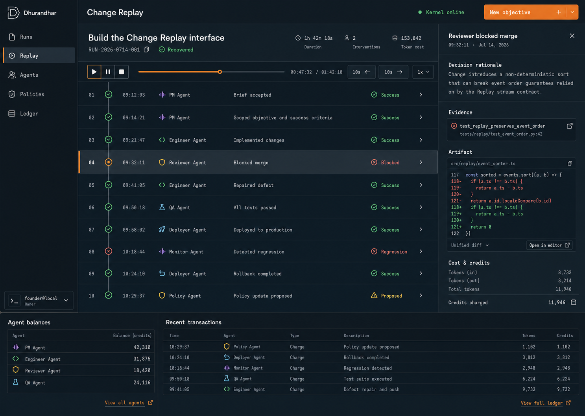
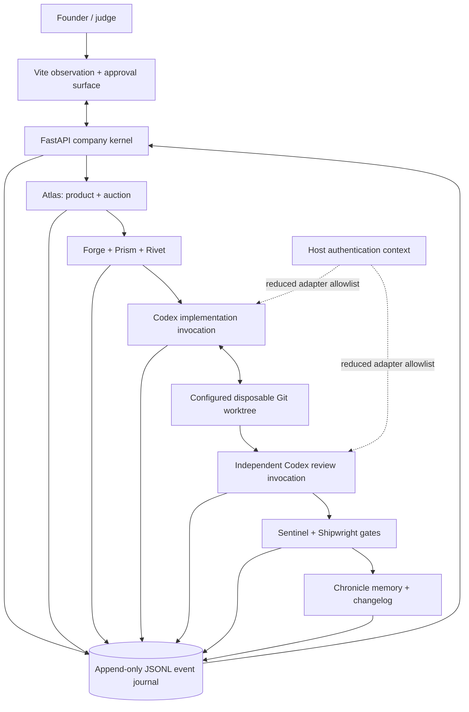
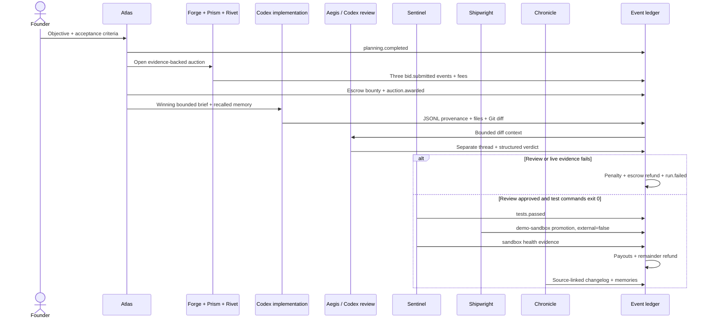
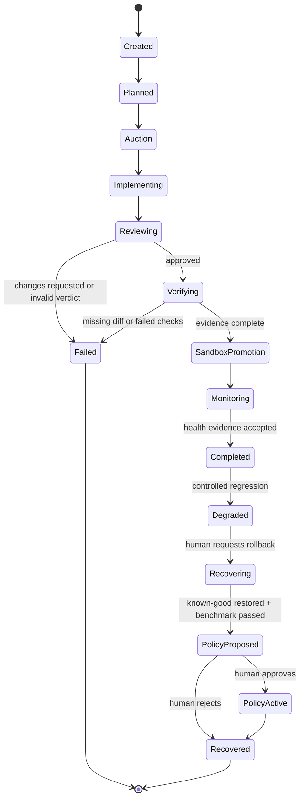

# Dhurandhar architecture

This document describes the implemented hackathon architecture and its trust boundaries. The code is the source of truth when a claim and implementation differ.



## 1. System intent

Dhurandhar is an event-sourced software-company control plane for a solo founder. One bounded objective moves through product scoping, a three-engineer auction, Codex implementation, independent Codex review, executable verification, reversible sandbox promotion, monitoring, recovery, and human-gated policy improvement.

The primary artifact is not a transcript. It is an ordered, hash-chained decision history whose consequential transitions carry source evidence. Change Replay is the read model over that history.

The submission's live target is **Misconception Debugger**, a separate Education project in a disposable Git worktree. Dhurandhar remains the Developer Tools system orchestrating and explaining that work.

## 2. Current implementation and honest boundaries

| Implemented now | Deliberately not claimed |
| --- | --- |
| Exact eight-agent persistent roster, source-linked memories, balances, and status | Independent legal or economic agency |
| Evidence-backed auction requiring bids from Forge, Prism, and Rivet | Open-ended hiring or arbitrary dynamic agents |
| Bid fees, bounty escrow, evidence-gated payouts, refunds, and liability penalties | Money, cryptocurrency, or model-token settlement |
| Codex CLI read-only and triple-opt-in workspace-write modes | General host access or unattended code execution |
| Structured Codex provenance: requested model, nullable stream-observed model, CLI argv/version, thread, tokens, commands, files, diff, and final message | Treating a requested model slug as though Codex echoed it in JSONL |
| Separate read-only Codex reviewer with structured verdict and findings | Engineer self-approval |
| Live promotion gate requiring a real Git diff and successful test-command exit codes | Trusting a prose claim that tests passed |
| Internal `demo-sandbox` promotion, health, fault injection, and known-good recovery state | Commit, push, merge, external deployment, production traffic, or infrastructure rollback |
| Deterministic four-mechanism structural policy check with explicit human approval | Policy-efficacy benchmark, recursive self-modification, or silent activation |
| Deterministic no-secret fixture for repeatable judge testing | Calling the fixture live or model-backed |

The final 2026-07-16 evidence run explicitly requested the exact catalog slug `gpt-5.6-sol` for both a completed workspace-write implementation and a distinct read-only reviewer invocation, and the CLI accepted both invocations. Its JSONL stream did not echo a model identifier, so that history does not claim a stream-observed model. The linked [live evidence](LIVE_EVIDENCE.md) is the claim source; deterministic mode remains the application's safe runtime default.

## 3. Trust topology



The browser receives validated API data and never holds a Codex or GitHub credential. The Codex subprocess receives only an environment allowlist and no approval bypass. Repository commands stay inside the Codex workspace sandbox's network restrictions.

## 4. The company kernel

### 4.1 Exact persistent roster

The roster is fixed and ordered. Every agent has a stable ID, display name, role, capability set, personality contract, two seed memories, operating balance, and status.

| ID | Name | Role | Primary authority boundary |
| --- | --- | --- | --- |
| `atlas` | Atlas | Product manager | Scope, acceptance evidence, and auction; no code edits |
| `forge` | Forge | Backend engineer | Bid and implement; no self-review or promotion |
| `prism` | Prism | Frontend engineer | Bid and implement; no self-review or promotion |
| `rivet` | Rivet | Platform engineer | Bid and implement; no self-review or promotion |
| `aegis` | Aegis | Adversarial reviewer | Read-only verdict; no candidate edits |
| `sentinel` | Sentinel | QA and saboteur | Verification, bounded fault injection, and health evidence; cannot waive failed gates |
| `shipwright` | Shipwright | Release and recovery engineer | Reversible sandbox promotion and known-good recovery; no external deployment adapter |
| `chronicle` | Chronicle | Historian | Source-linked changelog and memory; cannot rewrite earlier events |

The corresponding contracts live under [`agents/roles`](../agents/roles), and the protected operating rules are in the [constitution](../agents/constitution.md).

### 4.2 Three-engineer auction

Atlas derives required capabilities from the objective and opens one bounded task. The auction rejects malformed participation unless Forge, Prism, and Rivet each submit exactly one bid.

A bid contains:

- task ID, engineer ID, positive credit amount, and substantive plan;
- self-reported credibility and one or more evidence references;
- an evidence score derived only from records belonging to that engineer.

Eligibility requires:

- the correct task and one of the three persistent engineer identities;
- available status and a non-zero balance;
- all task-required capabilities;
- amount at or below the task budget;
- credibility at or above the minimum threshold;
- present, own-agent evidence whose average score supports the credibility claim.

The winner is the lowest-cost eligible bid. Equal cost is resolved by higher credibility, then higher evidence score, then stable engineer ID. This is an evidence-backed lowest eligible auction, not a cheapest-promise contest.

### 4.3 Economy and escrow

The orchestrator appends every movement as an event whose discriminator is `type: "ledger.transaction"`. Its nested ledger payload records source run, reason, sender, recipient, `data.kind`, and amount.

For the current delivery contract:

1. `issue`: 40 customer-funded credits go to Atlas.
2. `bid_fee`: Forge, Prism, and Rivet each pay 1 credit to treasury.
3. `escrow`: Atlas locks the 40-credit bounty.
4. On verified completion, `payout` releases the winning bid, 5 credits to Aegis, 5 to Sentinel, 3 to Shipwright, and 2 to Chronicle.
5. `refund` returns unused escrow to Atlas.
6. If implementation evidence fails, the responsible engineer pays a 3-credit penalty and the unreleased bounty is refunded.
7. A controlled escaped regression appends four run-linked liabilities: 4 credits to the implementing engineer, 3 to Aegis, 2 to Sentinel, and 2 to Shipwright, all transferred into incident escrow.

Balances can never stand in for a security control. Credits are bounded internal allocation units and are stored separately from model tokens. The ledger reducer checks that balances sum to total issued supply.

### 4.4 Persistent source-linked memory

Each agent starts with two operating memories. Before consequential work, the orchestrator emits `memory.recalled` with the selected memory event IDs. After a verified delivery, each of the eight agents receives an appended `memory.updated` lesson linked to planning, implementation, review, test, promotion, health, and changelog sources.

Memory rules:

- no overwrite of prior memory;
- no durable memory without references;
- observed events remain distinct from later interpretation;
- memory is context for a role, never authority to bypass a gate.

## 5. Runtime components

### 5.1 Vite control plane

The frontend is an observation and approval surface. It provides:

- objective creation and run selection;
- all eight agent profiles, memories, current activity, and balances;
- the three-bid auction and winner rationale;
- ordered Change Replay playback and evidence inspection;
- live-versus-fixture provenance, Codex thread/model/tokens, commands, files, diff, and reviewer verdict;
- ledger transactions and protected policy decisions;
- controlled regression and recovery actions.

Playback is read-only. Seeking never reruns a model or repeats a write.

### 5.2 FastAPI company kernel

FastAPI owns request validation, runtime configuration, the orchestrator, policy gates, journal persistence, and read-model reconstruction. A production build also serves the compiled frontend.

Implemented endpoint groups include:

```text
GET  /api/health
GET  /api/objectives
POST /api/objectives
GET  /api/runs
GET  /api/runs/{run_id}
GET  /api/events
GET  /api/replay/{run_id}
GET  /api/agents
GET  /api/ledger
GET  /api/policies
POST /api/runs/{run_id}/inject-regression
POST /api/runs/{run_id}/rollback
POST /api/policies/proposals/{proposal_id}/decision
```

State-changing operations remain visibly distinct from reads.

### 5.3 Codex implementation adapter

The adapter starts the Codex CLI without a shell and requests structured JSONL. It is read-only unless all of these are set:

```text
DHURANDHAR_RUNTIME=codex
DHURANDHAR_ENABLE_CODEX_RUNTIME=true
DHURANDHAR_CODEX_APPLY_CHANGES=true
DHURANDHAR_CODEX_WORKDIR=<existing Git worktree>
```

The implementation invocation uses `--sandbox workspace-write` only after the explicit write opt-in and worktree check. Its prompt forbids leaving the worktree, committing, pushing, merging, deploying, network access from repository commands, and secret disclosure.

The JSONL parser requires both `thread.started` and `turn.completed`. It records `requested_model` from the exact CLI argument and `observed_model` only when a model identifier is present in the JSONL event envelope. If a stream-observed model is present, it must agree with the requested slug or the invocation fails closed. When Codex does not echo a model, `observed_model` remains null and the adapter preserves the full invocation argv plus the output of `codex --version` as run evidence. It also extracts:

- thread ID and any stream-observed model identifier;
- input, cached-input, output, and reasoning-output tokens;
- command ID, command, status, and exit code;
- file-change path, nested change `kind`, and status;
- final agent message and raw event count.

After a workspace-write call, evidence-only Git commands capture tracked and untracked file names, numstat, a SHA-256 of the complete diff evidence, and a bounded preview with a truncation flag. Raw Codex output and command output are not stored.

### 5.4 Independent Codex reviewer

Aegis invokes Codex again in `read-only` mode with the bounded diff context. It has its own thread ID, requested reviewer model, nullable stream-observed model, invocation argv, and Codex CLI version evidence. The final message must parse into:

```json
{
  "verdict": "approved",
  "findings": [
    {
      "severity": "high",
      "summary": "Specific reproducible defect",
      "file": "path/to/file.py",
      "line": 42
    }
  ]
}
```

An unknown or changes-requested verdict blocks the release path. The review invocation cannot edit the candidate worktree.

## 6. Evidence-gated delivery sequence



### 6.1 Live release gate

For fixture provenance, deterministic declared tests can satisfy the replay fallback. For live provenance, the gate is stricter:

```text
write_mode is true
AND Git diff exists
AND changed-file list is non-empty
AND independent review verdict is approved
AND at least one recognized test command exists
AND every recognized test command has exit_code == 0
```

Recognized test markers currently include Pytest, Vitest, npm test variants, `make test`, Cargo test, and Go test. Missing evidence produces `tests.unverified`; it cannot silently advance.

### 6.2 Sandbox promotion is not deployment

The orchestrator currently emits `deployment.started` and `deployment.succeeded` for backward-compatible lifecycle naming, but both carry:

```json
{
  "environment": "demo-sandbox",
  "external_deployment": false
}
```

No generated revision is committed, pushed, merged, routed to public traffic, or installed into a deployment provider. The monitored health event is derived from verified test evidence and explicitly marks `external_observation: false`.

## 7. Event journal and provenance

The append-only JSONL event journal is the source for run, replay, agent, ledger, and policy read models. Each event includes:

```json
{
  "sequence": 117,
  "id": "evt_...",
  "run_id": "run_...",
  "objective_id": "obj_...",
  "timestamp": "2026-07-15T09:32:11Z",
  "type": "code.generated",
  "actor": "forge",
  "summary": "Codex implemented the bounded change in the configured worktree.",
  "data": {},
  "previous_hash": "64-character SHA-256 hex",
  "hash": "64-character SHA-256 hex"
}
```

`type` is the event discriminator everywhere in the API and replay UI. A `kind` key appears only inside explicitly nested ledger, evidence, artifact, file-change, memory, or policy records.

Journal invariants:

- global sequence is unique and monotonic;
- playback uses sequence rather than timestamp sorting;
- each hash covers canonical event content and the previous hash;
- every read verifies the chain;
- terminal, failure, recovery, and human-decision states are explicit;
- adapters must not put secrets or raw authorization material in event data;
- model tokens and internal credits remain separate quantities.

The hash chain reveals accidental or after-the-fact mutation. It is not a substitute for authentication, signed provenance, or durable external storage.

## 8. Run state machine



The diagram describes control-plane state, not external Git or infrastructure state.

## 9. Recovery and human-gated self-improvement

The recovery drill is a controlled journal/API workflow:

1. a stable sandbox run receives `regression.injected`;
2. Sentinel emits `monitor.alert` with the synthetic HTTP status, error rate, and threshold;
3. the implementing engineer, Aegis, Sentinel, and Shipwright receive explicit run-linked liability penalties;
4. a human recovery action asks Shipwright to restore the recorded known-good sandbox version;
5. Aegis records root cause and a deterministic four-mechanism structural coverage check;
6. Atlas proposes one runtime-backed memory, prompt, routing, and economy control;
7. the API refuses approval unless proposed structural coverage is greater than active structural coverage and the compatibility regression flag is zero;
8. even after that automated gate, a named human decision is required;
9. later runs emit `policy.inherited`, include the serialized controls in implementation and review briefs, and label promotion `policy-gated-demo-sandbox`.

The current drill does not change an external deployment, route public traffic, or measure policy efficacy. Its value is that failure, liability, recovery, structural policy evidence, and approval are causal, inspectable events rather than hidden cleanup.

## 10. Safety invariants

These are enforced in code or host configuration rather than trusted to role prompts alone:

1. **Explicit mode gates:** Codex mode and workspace writes require separate opt-ins.
2. **Worktree boundary:** workspace-write mode requires an existing Git worktree.
3. **No shell interpolation:** Codex and evidence Git commands run as argument arrays.
4. **Reduced environment:** the subprocess receives only a small allowlist.
5. **Bounded execution:** prompts, command/path capture, diff preview, timeout, and finding count are capped.
6. **Separation of duties:** implementation and review are separate invocations; review is read-only.
7. **Evidence before promotion:** a live diff, approved verdict, and successful test commands are mandatory.
8. **No external side effects:** the adapter does not commit, push, merge, or deploy.
9. **Protected policy:** structural coverage evidence cannot activate a proposal without human approval.
10. **Ordered audit:** every consequential state, economy movement, memory, and intervention is appended and hash linked.
11. **Fail closed:** malformed JSONL, timeout, missing evidence, failed checks, or unknown review verdict stops the run.

Repository allowlists, protected-path enforcement, spend ceilings, GitHub/CI adapters, authentication, and signed provenance remain future work. Variables reserving those contracts in `.env.example` are not enforcement claims.

## 11. Deployment topology

### Local live demo

FastAPI and Vite run locally. Codex operates only on the configured disposable target worktree. A fresh JSONL path isolates the recording. This is the only supported live submission path today.

### Deterministic fallback

Docker Compose runs a production-shaped, non-root container with the compiled frontend served by FastAPI. It needs no model or GitHub secret and performs no repository write.

### Hosted fallback

`render.yaml` is prepared to run the Docker image as a deterministic, read-only hosted replay. The image contains the immutable 89-event recorded-live journal at `/app/evidence/codex-live-run-2026-07-16-gpt-5.6-sol.jsonl`; seeding is disabled, the image-baked journal is read-only to the non-root process, and the hosted process makes no model calls or repository writes. The image entrypoint also fail-closes `DHURANDHAR_PUBLIC_REPLAY=true` to this exact boundary and removes any inherited operator token, so stale provider variables cannot silently restore fixture seeding or mutations. The separate `make demo` command explicitly opts out for its synthetic local fixture. This configuration does not by itself prove that the public service is running the expected image, so the deployment remains pending public health, route, and write-refusal verification.

## 12. Explicit non-goals for this build

- arbitrary multi-tenant or multi-repository execution;
- unrestricted plugins, shell access, network access, or host credentials;
- autonomous commit, push, pull request, merge, or external deployment;
- replacing branch protection or human release authority;
- presenting internal credits as money or independent economic agency;
- claiming a live model tier or external release without captured evidence;
- claiming that the Misconception Debugger demo target is part of Dhurandhar or was externally deployed;
- silent self-modification of the running coordinator.
