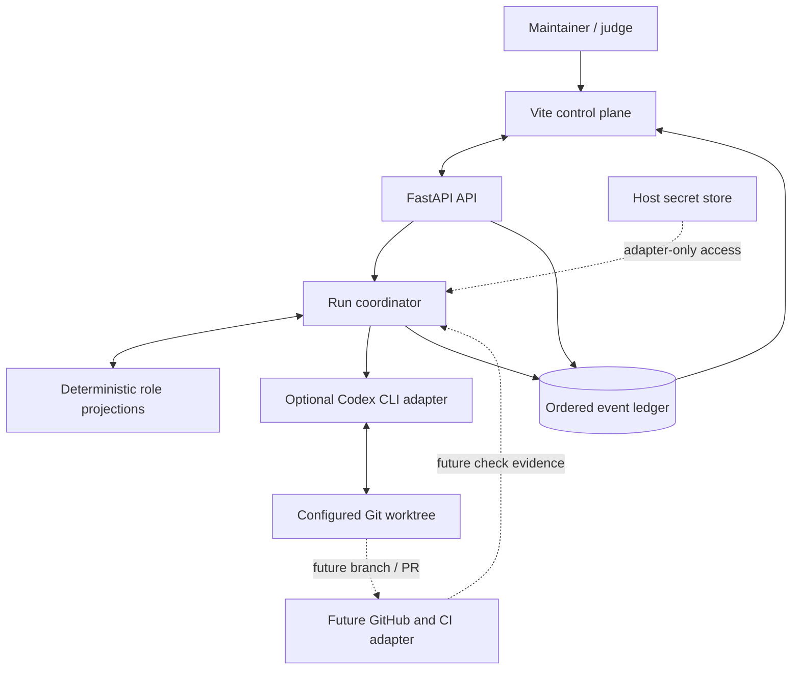
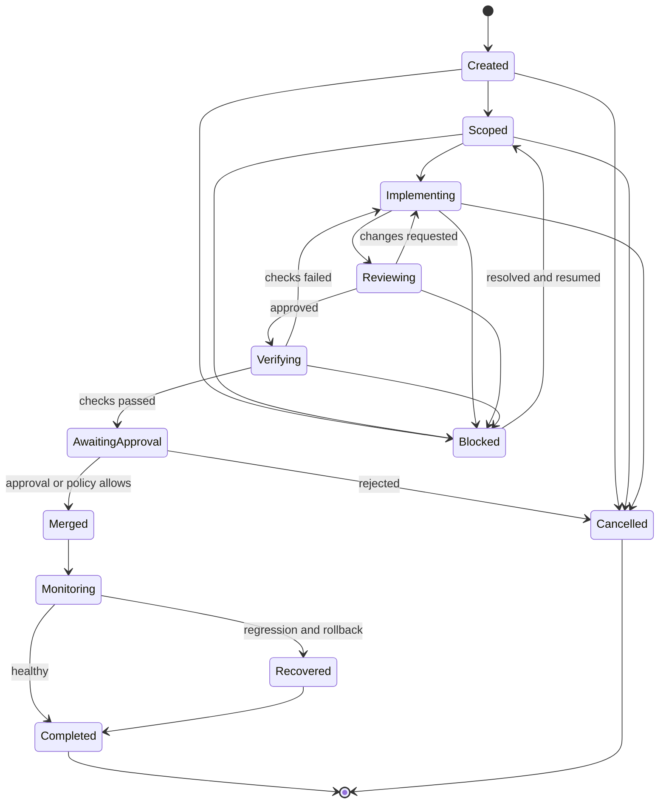
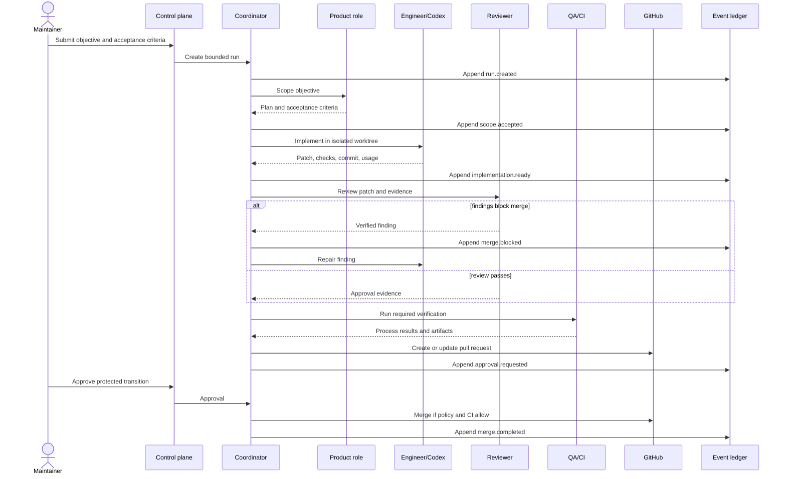

# Dhurandhar architecture

This document defines the target architecture and trust model for the hackathon build. The implementation remains the source of truth when code and documentation differ.


## 1. System intent

Dhurandhar turns one bounded software objective into an evidence-backed delivery run. The implemented MVP uses deterministic role projections and an optional Codex CLI implementation runtime, then exposes every consequential transition through Change Replay.

The current primary output is an ordered, hash-chained decision history with structured implementation, review, test, deployment, monitor, recovery, ledger, and policy events. A branch or pull request with independently captured diff and CI evidence is the next adapter milestone.

## 2. Bootstrap boundary

The seed system is human-authored. It includes:

- the API and deterministic run coordinator;
- the first event schema and persistence layer;
- the optional Codex CLI runtime boundary;
- the initial role contracts and safety policy;
- deployment and local-development scaffolding;
- a minimal UI capable of starting or loading a run.

The implemented self-improvement loop changes future orchestration policy after incident recovery, a benchmark win, and human approval. Experimental Codex workspace edits require a third opt-in and a Git worktree. Branch creation, commit capture, pull requests, CI ingestion, merge, and infrastructure deployment remain target architecture. The process is self-hosting, not originless; evidence determines which changes may be described as agent-authored.

Protected safety policy, secrets, repository access, budget ceilings, and production release authority remain outside autonomous control.

### 2.1 Implementation status

| Implemented now | Target adapter work |
| --- | --- |
| FastAPI API and compiled Vite UI in one container | Authentication and multi-tenant isolation |
| Append-only SHA-256-chained JSONL journal and deterministic replay | Durable database/object storage and signed provenance |
| Objective lifecycle, role projections, internal credit ledger, monitored fault injection, rollback, and recovery | Real CI, deployment-provider, and monitor ingestion |
| Four benchmark-gated improvement kinds with human promotion and inheritance | Agent-authored policy patches with independent evaluation infrastructure |
| Codex CLI read-only mode and triple-opt-in configured-worktree writes | Per-run worktree creation, diff/command/token capture, commit, PR, and merge adapters |
| Deterministic no-secret sample | Direct GPT-5.6 role runtime with measured usage evidence |

## 3. Context diagram



## 4. Runtime components

### 4.1 Vite control plane

The frontend is an observation and approval surface. It provides:

- objective creation and run selection;
- current phase, health, actors, and measured usage;
- ordered playback of the event ledger;
- evidence inspection for structured artifacts, tests, reviews, versions, usage, and rollback;
- approval prompts for protected transitions;
- agent allocation and transaction views.

The browser never holds an OpenAI or GitHub write token. It receives validated event data from FastAPI. Generic secret-redaction middleware is target work, so adapters must avoid placing secrets in events.

### 4.2 FastAPI API

The API owns authentication boundaries, request validation, read models, and server-sent or polled event updates. A production build also serves the compiled frontend from `frontend/dist`.

Representative endpoint groups:

```text
GET  /api/health
GET  /api/objectives
POST /api/objectives
GET  /api/runs
GET  /api/runs/{run_id}
GET  /api/events
GET  /api/replay/{run_id}
POST /api/runs/{run_id}/inject-regression
POST /api/runs/{run_id}/rollback
GET  /api/agents
GET  /api/ledger
GET  /api/policies
POST /api/policies/proposals/{proposal_id}/decision
```

Exact paths may evolve, but read operations and state-changing operations should remain visibly distinct.

### 4.3 Deterministic run coordinator

The coordinator owns the state machine. Models may recommend an action; only the coordinator can validate and apply a transition. This prevents a role response from directly merging code, changing policy, or expanding repository scope.

Implemented responsibilities:

- validate objectives and strict API payloads;
- assign stable objective/run identifiers and monotonic event sequences;
- invoke the selected deterministic or Codex runtime boundary;
- append immutable events before exposing a new read-model state;
- reduce run, agent, ledger, and policy state from the journal;
- contain runtime failure as an explicit terminal event;
- execute fault injection, detection, rollback, analysis, benchmark, approval, and policy inheritance.

Target additions are repository allowlist enforcement, per-run worktrees, deterministic command/test capture, step/token/time/spend ceilings, CI evidence ingestion, and resumable external jobs.

### 4.4 Role projections

Roles are bounded contracts, not simulated people. In the current sample they are deterministic coordinator events; they are not claimed as GPT-5.6 calls.

| Role | Produces | Cannot do directly |
| --- | --- | --- |
| Product | Scope, acceptance criteria, task plan | Edit code or merge |
| Engineer | Implementation plan and Codex task | Approve its own work |
| Reviewer | Findings with severity and evidence | Edit the candidate branch |
| QA | Risk-based checks and verification result | Waive failed required checks |
| Monitor | Post-release health assessment | Rewrite history |
| Policy | Proposed policy amendment with rationale | Apply protected policy |

Persistent memory should be concise, attributable, and scoped to prior decisions. A credit balance or personality is never treated as a security boundary.

### 4.5 Codex implementation adapter

The adapter selects one configured directory, passes a scoped implementation task to Codex, and records a bounded result summary, change identifier, runtime mode, and terminal failure or timeout. It defaults to a read-only sandbox. Workspace writes require `DHURANDHAR_RUNTIME=codex`, `DHURANDHAR_ENABLE_CODEX_RUNTIME=true`, `DHURANDHAR_CODEX_APPLY_CHANGES=true`, and a Git worktree.

The subprocess receives only a reduced environment allowlist. It does not commit, push, merge, deploy, or enable approval bypasses. Independent patch, command, check, session, token, and commit capture are target work; generated changes remain untrusted.

### 4.6 Git, GitHub, and CI adapters (target)

The current repository ships no GitHub/CI adapter. The target adapter will create an isolated worktree, capture inspectable diffs and commits, and create a branch or pull request only for an exact allowlisted repository.

CI results are deterministic evidence. A model summary of a test is not a substitute for the test process exit status and captured output.

### 4.7 Event ledger and read models

The append-only event ledger is the source for Change Replay. Mutable read models may be rebuilt from ordered events.

A representative event envelope is:

```json
{
  "id": "evt_01J...",
  "run_id": "run_20260714_001",
  "sequence": 4,
  "timestamp": "2026-07-14T09:32:11Z",
  "actor": "sentinel",
  "type": "monitor.alert",
  "summary": "Sentinel detected an error-budget breach",
  "data": {"http_status": 500, "error_rate": 0.42, "threshold": 0.01},
  "previous_hash": "64-character SHA-256 hex",
  "hash": "64-character SHA-256 hex"
}
```

Required properties:

- `(run_id, sequence)` is unique and monotonic;
- playback order never depends only on wall-clock timestamps;
- structured evidence travels in `data`; future external artifacts require stable identifiers;
- adapters must not persist secrets or sensitive command output;
- token usage and internal credits are stored as different quantities;
- terminal states are explicit and replayable;
- hashes may reveal accidental mutation but do not replace access control or signed provenance.

## 5. Run state machine



An adapter error, exhausted budget, policy violation, or missing approval produces a visible blocked or terminal event. It must not disappear into an agent transcript.

## 6. Objective-to-change sequence



## 7. Self-improvement path

Self-improvement is the same workflow aimed at the Dhurandhar repository:

1. A maintainer creates an explicit objective with acceptance criteria.
2. Policy confirms that the target paths are agent-editable.
3. Codex works in a new branch or worktree; it cannot patch the running container.
4. Reviewer and QA evaluate the change independently of the engineer role.
5. CI must pass.
6. Protected files or policy changes require human approval.
7. A release creates a new immutable deployment artifact.
8. Monitoring may request rollback to the prior artifact.

The running coordinator never `exec`s newly generated code inside its own process. Changes take effect only through a new build or explicitly controlled restart.

## 8. Safety invariants

The following invariants should be enforced in code rather than prompts:

1. **Repository scope:** writes require an exact allowlist match.
2. **Workspace isolation:** every live run uses a dedicated branch or worktree.
3. **No model-held secrets:** adapters perform authenticated operations; prompts receive redacted context.
4. **Bounded execution:** every run has step, time, token, and spend ceilings.
5. **Evidence before transition:** review, verification, merge, deployment, and rollback states require deterministic evidence references.
6. **Separation of duties:** the engineer cannot approve its own change.
7. **Protected policy:** agents may propose but cannot autonomously weaken safety controls.
8. **Merge safety:** automatic merge is disabled by default and still requires required checks.
9. **Ordered audit:** replay uses monotonic sequence numbers and explicit terminal events.
10. **Fail closed:** missing evidence, uncertain repository identity, or an adapter timeout blocks the transition.

## 9. Failure and recovery model

| Failure | Required behavior | Replay evidence |
| --- | --- | --- |
| Model timeout or malformed response | Retry within budget, then block | attempt count, validation error, budget state |
| Codex command failure | Preserve workspace; return to engineer or block | command, exit code, redacted output |
| Reviewer finding | Block verification until repaired or explicitly waived by policy | finding, severity, evidence link, repair commit |
| CI failure | Prevent merge; return to implementation | check run, logs, failing test |
| Post-release regression | Stop further release work and propose or execute allowed rollback | monitor signal, release IDs, rollback result |
| Process restart | Rebuild read state from ledger and resume only idempotent work | last durable sequence and resume event |
| Budget exhausted | Stop dispatching model/tool work | measured usage and terminal budget event |

## 10. Deployment topology

### Local and judge mode

Docker Compose runs a single production-shaped container. The frontend is built to static assets and served by FastAPI. The append-only JSONL journal is sufficient for a single-user replay and is persisted in a Docker volume locally.

### Hosted demo

`render.yaml` deploys the same Dockerfile. Hosted sample mode is deterministic and repository-read-only. Its `/tmp` JSONL file is ephemeral; a durable demo should use external storage and authenticated access.

## 11. Observability

At minimum, capture:

- run and step latency;
- model input/output tokens by role;
- estimated spend by run;
- internal credit transactions, separately;
- Codex session and command status;
- review findings and disposition;
- test and CI outcomes;
- merge, deployment, regression, and rollback identifiers;
- human approvals or interventions.

Logs should carry `run_id`, `event_id`, and `sequence` so a UI event can be correlated with backend and adapter logs.

## 12. Explicit non-goals for the hackathon build

- arbitrary multi-tenant execution;
- unrestricted plugin or shell access;
- replacing branch protection or human release authority;
- proving that internal credits create independent economic actors;
- claiming agent authorship without inspectable repository and run evidence;
- building a second application merely to demonstrate code generation.
